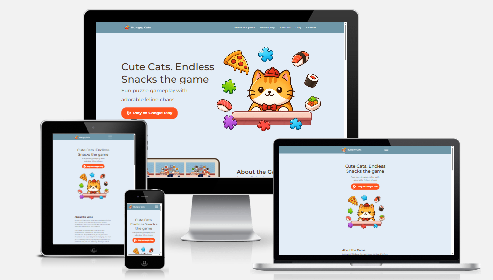

# Mobile Game Presentation Website 
- ** Cute Cats. Endless Snacks **

**Team Project (2 Developers and 1 Designer)**

- ** Developer:** [Yevheniia-Serhieieva](mailto:y.o.serhieieva@gmail.com)
- ** Developer:** [Anhelina Pushkash](mailto:anhelinapush@gmail.com)

---

## 📌 Overview

This is a **one-page presentation website** for a mobile game. The website
showcases all essential game information, features, and media, providing a fully
interactive experience for users. 
The website is designed to showcase the game, highlight its features, and encourage users to download it.
The project is built with **vanilla JavaScript, HTML, and CSS**, following a
**mobile-first approach** to ensure a smooth experience across **mobile and desktop**.

---

## 🛠️ Tech Stack

---

## 🌐 Tools & Platforms

---

## 📸 Screenshot

